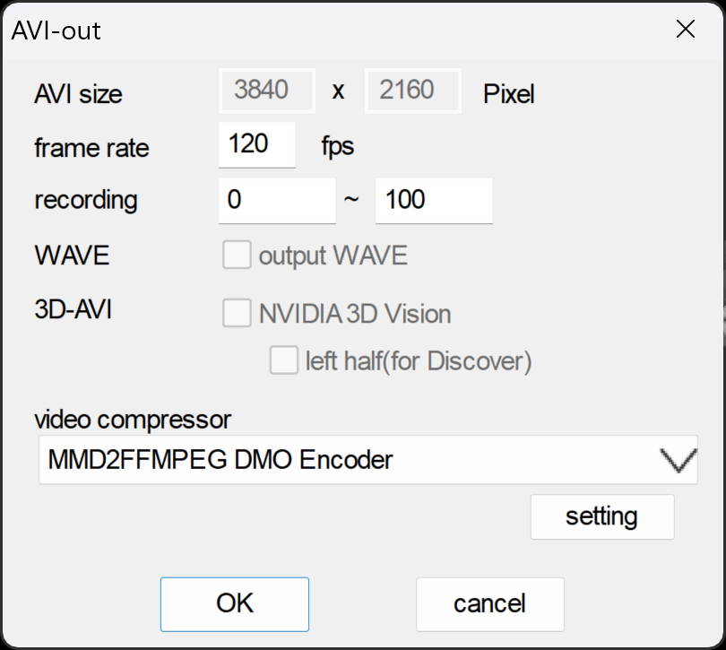
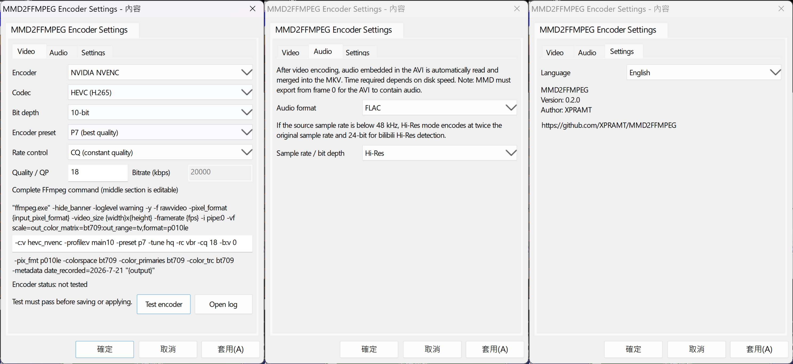

[English](README.md) | [繁體中文](README_TW.md)

# MMD2FFMPEG

MMD2FFMPEG is a 64-bit DirectX Media Object (DMO) encoder for MikuMikuDance 9.32 x64. It sends MMD-rendered RGB frames directly to FFmpeg, replacing the oversized AVI workflow with an MKV video produced beside the AVI path selected in MMD. It can also read audio embedded in MMD's AVI and mux it into the final MKV.

## Features

- Appears in MMD's AVI encoder list as **MMD2FFMPEG DMO Encoder**.
- Streams MMD's RGB24 frames to FFmpeg through stdin.
- The MKV uses the same name and folder as MMD's AVI output. After a successful FFmpeg encode, MMD2FFMPEG automatically removes MMD's placeholder AVI; the AVI is preserved if encoding fails.
- After video encoding, can read audio embedded in MMD's AVI and mux it into the MKV as FLAC, WAV/PCM, or no audio.
- Includes an optional Hi-Res audio mode: audio below 48 kHz is encoded at twice its original sample rate and 24-bit depth.
- Writes the MKV `DATE_RECORDED` metadata field automatically when encoding starts, using the local date in `yyyy-M-d` format.
- Supports CPU software encoding, NVIDIA NVENC, Intel Quick Sync, and AMD AMF through FFmpeg.
- Supports AVC, HEVC, and AV1; 8-bit and supported 10-bit output; CRF/CQ, constant QP, and target-bitrate modes.
- Uses the frame rate chosen by MMD and marks video as BT.709.
- Requires a successful manual encoder test before settings can be saved or applied.
- Includes Traditional Chinese, Simplified Chinese, Japanese, English, and system-default UI languages.
- Writes per-export diagnostics under `%LOCALAPPDATA%\MMD2FFMPEG\logs`, including FFmpeg version, input frames, measured input FPS, elapsed time, exit code, and output size.
- Includes **MMD Locale Launcher**, an optional companion that starts MMD through NTLEA with Japanese CP932 settings and can register itself as a `.pmm` opener.

## Requirements

- MikuMikuDance 9.32 x64.
- FFmpeg available as `ffmpeg.exe` on the system `PATH`.
- Windows x64.

Check the FFmpeg installation before building:

```powershell
ffmpeg -version
```

## Install FFmpeg on Windows

1. Open the [official FFmpeg download page](https://ffmpeg.org/download.html). Its Windows section links to current prebuilt Windows packages.
2. Download an x64 build, extract it to a permanent location such as `C:\FFmpeg`, and confirm that `C:\FFmpeg\bin\ffmpeg.exe` exists.
3. Open **System Properties > Advanced > Environment Variables**. Under either **User variables** (current user) or **System variables** (all users), edit `Path`, choose **New**, and add `C:\FFmpeg\bin`.
4. Close and reopen PowerShell, then verify the installation:

   ```powershell
   ffmpeg -version
   ```

MMD2FFMPEG runs `ffmpeg.exe` from `PATH`; do not configure a hard-coded FFmpeg path.

## Installation

### Recommended: install from a GitHub Release

1. Download `MMD2FFMPEG-x64.zip` from the [Releases page](https://github.com/XPRAMT/MMD2FFMPEG/releases).
2. Extract the ZIP to a local folder.
3. Install FFmpeg and add its `bin` folder to `PATH` as described above.
4. Double-click `install-user.bat` in the extracted folder. It starts the installer with the required temporary PowerShell execution-policy bypass and keeps the window open so that you can read the result.
5. Start MMD again.

The installer registers only for the current Windows user and places the runtime files in `%LOCALAPPDATA%\MMD2FFMPEG`.

### Release package contents

| File | Purpose |
| --- | --- |
| `install-user.bat` | Recommended one-click installer. Starts `install-user.ps1` without changing the system execution policy. |
| `install-user.ps1` | Copies the runtime files to the current user's local MMD2FFMPEG folder, migrates compatible configuration, and registers the DMO for the current user. |
| `uninstall-user.bat` | Recommended one-click uninstaller. Starts `uninstall-user.ps1` without changing the system execution policy. |
| `uninstall-user.ps1` | Removes the current user's DMO registration. Runtime files, configuration, and logs are deliberately retained for manual backup or removal. |
| `mmd2ffmpeg_dmo.dll` | The MMD-visible DirectX Media Object encoder. It receives MMD frames and streams them to FFmpeg to create the MKV. |
| `mmd2ffmpeg_cleanup.exe` | Runs after successful video encoding. It waits for MMD to release the AVI, muxes embedded audio into MKV when enabled, then deletes the placeholder AVI and records the result in the export log. |
| `MMDLocaleLauncher.exe` | Optional per-user MMD launcher. It starts MMD via NTLEA using Japanese CP932 settings and can be registered as a `.pmm` opener. NTLEA itself is not bundled. |

### Build from source

1. Clone or download this repository.
2. Install Visual Studio 2022 with the **Desktop development with C++** workload.
3. Close MMD completely.
4. Build and register the per-user DMO:

   ```powershell
   & 'C:\APP\MMD\MMD2FFMPEG\scripts\build.ps1'
   & 'C:\APP\MMD\MMD2FFMPEG\scripts\install-user.ps1'
   ```

### Creating a Release package

Maintainers can create the GitHub Release asset after a successful build:

```powershell
& 'C:\APP\MMD\MMD2FFMPEG\scripts\make-release.ps1'
```

This creates `release\MMD2FFMPEG-x64\` and `release\MMD2FFMPEG-x64.zip`.

`build.ps1` runs this packaging step automatically after every successful build.

## Optional MMD Locale Launcher

`MMDLocaleLauncher.exe` is for non-Japanese Windows installations where MMD needs NTLEA to avoid mojibake. It uses NTLEA's Japanese profile equivalent to:

```text
ntleas.exe MikuMikuDance.exe C932 L1041 "FMS PGothic" P4
```

1. Run `MMDLocaleLauncher.exe` from the Release package or `%LOCALAPPDATA%\MMD2FFMPEG`.
2. On its first run, select the x64 `ntleas.exe` and `MikuMikuDance.exe` paths, then save. The paths are stored in `%LOCALAPPDATA%\MMDLocaleLauncher\config.ini`.
3. After setup, double-clicking `MMDLocaleLauncher.exe` starts MMD through NTLEA. Opening a `.pmm` through the launcher passes that PMM to MMD using NTLEA's documented `A` application-argument option.
4. Select **Register and set as the default opener for .pmm** during setup to add the launcher to Windows. Windows displays its own default-app confirmation UI; the launcher never silently overrides the user's file association.

To change the two executable paths later, run:

```text
MMDLocaleLauncher.exe /settings
```

This is a CP932 compatibility launcher, not a full UTF-8 conversion of MMD. Paths containing characters that CP932 cannot represent may still be limited by MMD itself.

Its setup window uses a per-monitor V2 DPI-aware dark theme. The window icon and registered `.pmm` file icon are read from the selected `MikuMikuDance.exe`.

## Use in MMD

1. Select **File > AVI Output** and choose the desired AVI save path.
2. In **Video encoder**, select **MMD2FFMPEG DMO Encoder**.



3. Open **Detailed settings**, configure the encoder, and use **Test encoder**.



1. Save or apply only after the test passes.
2. Start AVI output. The final MKV is written beside the selected AVI path; MMD's placeholder AVI is deleted automatically after successful video-only output or audio muxing.

## Audio muxing

The **Audio** tab controls what happens after video encoding finishes:

| Setting | Behavior |
| --- | --- |
| FLAC | Losslessly encodes PCM audio embedded in the AVI as FLAC and muxes it into the MKV. |
| WAV | Muxes PCM audio embedded in the AVI into the MKV. |
| None | Does not mux audio. |
| Original | Keeps the source sample rate and bit depth. |
| Hi-Res | When the source is below 48 kHz, uses twice the source sample rate and 24-bit depth for bilibili Hi-Res detection. |

For MMD to place audio in the AVI, select **Include WAV** in MMD's AVI output settings and export starting from **frame 0**. If the export begins later, the AVI exported by MMD contains no audio, so there is nothing for MMD2FFMPEG to mux. The AVI is deleted only after successful video-only completion or successful audio muxing; it is retained when muxing fails for diagnosis.

## Updating and uninstalling

- **Update:** Close MMD, run the build command, then run `install-user.bat` again. Existing `config.ini` is preserved.
- **Uninstall:** Close MMD and double-click `uninstall-user.bat` in the Release package, or run from source:

  ```powershell
  & 'C:\APP\MMD\MMD2FFMPEG\scripts\uninstall-user.ps1'
  ```

  This removes the per-user DMO registration. Runtime files, configuration, and logs under `%LOCALAPPDATA%\MMD2FFMPEG` are intentionally left in place for manual backup or deletion.

## Configuration and diagnostics

| Item | Location |
| --- | --- |
| Encoder settings | MMD: **AVI Output > Video encoder > Detailed settings** |
| Output path | The AVI path selected in MMD; MMD2FFMPEG always changes its extension to `.mkv` |
| Per-user configuration | `%LOCALAPPDATA%\MMD2FFMPEG\config.ini` |
| Per-export logs | `%LOCALAPPDATA%\MMD2FFMPEG\logs` |

The advanced command field exposes the editable FFmpeg video-argument section. The fixed input, color conversion, output-container arguments, and output path remain controlled by MMD2FFMPEG.

## Troubleshooting

| Symptom | Check |
| --- | --- |
| Encoder is missing from MMD | Confirm that MMD is x64, rerun `install-user.bat`, then restart MMD. |
| Test encoder fails | Run `ffmpeg -version`; ensure the selected hardware encoder is supported by the active FFmpeg, GPU, and driver. |
| Installer cannot replace the DLL | Close every MMD window and retry the installer. |
| AVI remains or no MKV appears | Open the log folder, inspect the latest log, and check the FFmpeg exit code. |
| MKV has no audio | Enable MMD WAV/audio output and export from frame 0. Confirm that the temporary AVI contains an audio stream. |
| Very large AVI file | Ensure **MMD2FFMPEG DMO Encoder** is selected and MMD did not fall back to uncompressed output. |

## Notes

- MMD output is SDR BT.709. HDR output is not implemented.
- Hardware encoder availability depends on the installed FFmpeg build, GPU, and driver. Use **Test encoder** after changing encoder settings.
- The encoder launches `ffmpeg.exe` from `PATH`. Review custom FFmpeg arguments before saving them.
