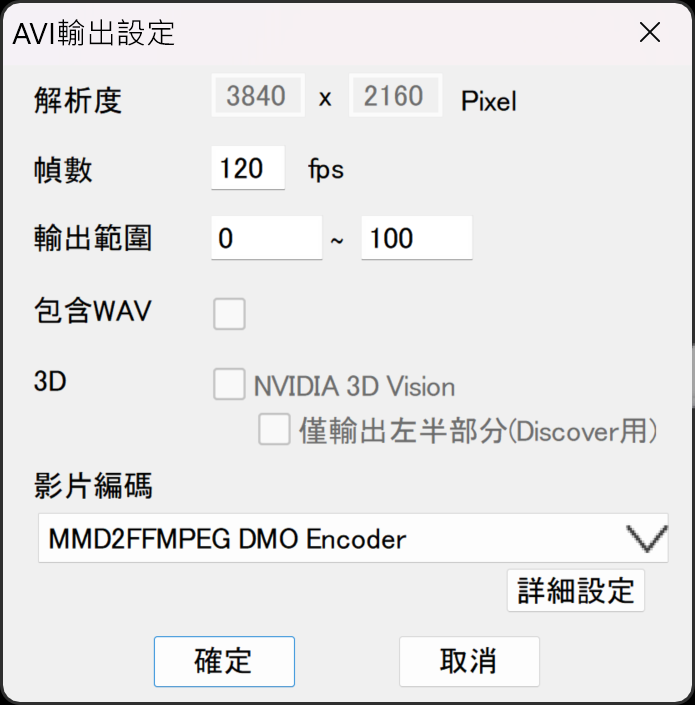
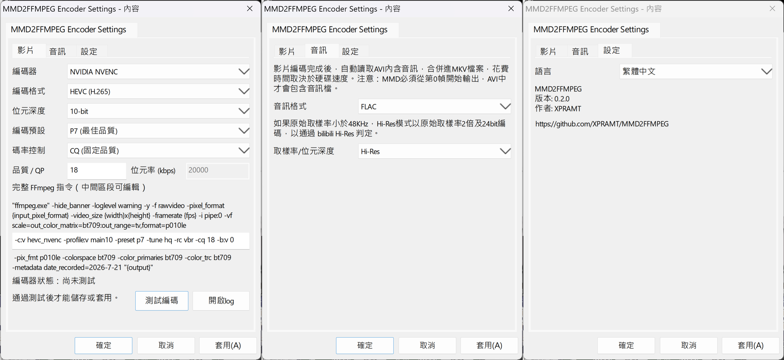

[English](README.md) | [繁體中文](README_TW.md)

# MMD2FFMPEG

MMD2FFMPEG 是為 MikuMikuDance 9.32 x64 製作的 64-bit DirectX Media Object（DMO）編碼器。它會把 MMD 渲染出的 RGB 畫面直接送到 FFmpeg，並在 MMD 選擇的 AVI 路徑旁輸出 MKV，避免傳統 AVI 流程產生巨大檔案。它也能讀取 MMD AVI 內含的音訊，合併進最終 MKV。

## 功能

- 在 MMD 的 AVI 編碼器清單中顯示為 **MMD2FFMPEG DMO Encoder**。
- 透過 stdin 將MMD輸出的 RGB24 畫面串流送給 FFmpeg。
- MKV 將使用與 MMD 輸出的 AVI 相同檔名及資料夾。FFmpeg 成功完成編碼後，MMD2FFMPEG 會自動刪除 MMD 的佔位 AVI；若編碼失敗則保留 AVI 以供診斷。
- 影片編碼完成後，可讀取 MMD AVI 內含音訊，並以 FLAC、WAV/PCM 或無音訊模式合併進 MKV。
- 提供選用的 Hi-Res 音訊模式：來源低於 48 kHz 時，以原始取樣率 2 倍及 24-bit 編碼。
- 編碼開始時會自動寫入 MKV 的 `DATE_RECORDED` metadata 欄位，使用本機日期 `yyyy-M-d` 格式。
- 透過 FFmpeg 支援 CPU 軟體編碼、NVIDIA NVENC、Intel Quick Sync、AMD AMF。
- 支援 AVC、HEVC、AV1、8-bit 與可用的 10-bit 輸出，以及 CRF/CQ、固定 QP、目標位元率模式。
- 跟隨 MMD 設定的影格率，並標記輸出為 BT.709。
- 編碼設定必須先通過手動「測試編碼」才能儲存或套用。
- 支援系統預設、繁體中文、簡體中文、日本語、English 介面。
- 每次輸出會在 `%LOCALAPPDATA%\MMD2FFMPEG\logs` 建立診斷 log，包含 FFmpeg 版本、輸入幀數、實際輸入 FPS、耗時、exit code、輸出大小。

## 音訊合併

**音訊**頁籤控制影片編碼完成後的處理方式：

| 設定 | 行為 |
| --- | --- |
| FLAC | 將 AVI 内的 PCM 音訊無損編碼為 FLAC，並合併進 MKV。 |
| WAV | 將 AVI 内的 PCM 音訊合併進 MKV。|
| None | 不合併音訊。 |
| 原始 | 保留來源取樣率與位元深度。 |
| Hi-Res | 來源低於 48 kHz 時，以原始取樣率 2 倍及 24-bit 編碼，以通過 bilibili Hi-Res 判定。 |

要讓 MMD 將音訊寫入 AVI，必須開啟 MMD 的 WAV／音訊輸出，且必須從**第 0 幀**開始輸出。若開始幀較晚，MMD輸出的 AVI 將不含音訊，MMD2FFMPEG 就沒有可合併的音訊。只有純影片輸出成功或音訊合併成功後才會刪除 AVI；若合併失敗，會保留 AVI 以供診斷。

## 需求

- MikuMikuDance 9.32 x64。
- 系統 `PATH` 中可使用 `ffmpeg.exe`。
- Windows x64。

建置前先確認 FFmpeg 可用：

```powershell
ffmpeg -version
```

## 在 Windows 安裝 FFmpeg

1. 開啟 [FFmpeg 官方下載頁](https://ffmpeg.org/download.html)。Windows 區塊會連結目前可用的 Windows 預編譯套件。
2. 下載 x64 版本，解壓縮到固定位置，例如 `C:\FFmpeg`，並確認 `C:\FFmpeg\bin\ffmpeg.exe` 存在。
3. 開啟 **系統內容 > 進階 > 環境變數**。在 **使用者變數**（僅目前使用者）或 **系統變數**（所有使用者）的 `Path` 按 **編輯**，選擇 **新增**，加入 `C:\FFmpeg\bin`。
4. 關閉並重新開啟 PowerShell，執行以下指令確認：

   ```powershell
   ffmpeg -version
   ```

MMD2FFMPEG 會從 `PATH` 執行 `ffmpeg.exe`，不需也不應設定寫死的 FFmpeg 路徑。

## 安裝

### 建議方式：從 GitHub Release 安裝

1. 從專案的 [Releases 頁面](https://github.com/XPRAMT/MMD2FFMPEG/releases)下載 `MMD2FFMPEG-x64.zip`。
2. 將 ZIP 解壓縮到本機資料夾。
3. 依照上方說明安裝 FFmpeg，並將其 `bin` 資料夾加入 `PATH`。
4. 雙擊解壓縮資料夾內的 `install-user.bat`。它會以暫時略過 PowerShell 執行原則的方式啟動安裝器，並保留視窗以便查看結果。
5. 再次開啟 MMD。

安裝器只會為目前 Windows 使用者註冊，執行檔會放在 `%LOCALAPPDATA%\MMD2FFMPEG`。

### Release 安裝包內容

| 檔案 | 功能 |
| --- | --- |
| `install-user.bat` | 建議使用的一鍵安裝器；啟動 `install-user.ps1`，不會變更系統的執行原則。 |
| `install-user.ps1` | 將執行檔複製到目前使用者的本機 MMD2FFMPEG 資料夾，遷移相容設定，並為目前使用者註冊 DMO。 |
| `uninstall-user.bat` | 建議使用的一鍵解除安裝器；啟動 `uninstall-user.ps1`，不會變更系統的執行原則。 |
| `uninstall-user.ps1` | 移除目前使用者的 DMO 註冊。執行檔、設定與 log 會刻意保留，方便手動備份或刪除。 |
| `mmd2ffmpeg_dmo.dll` | MMD 可見的 DirectX Media Object 編碼器；接收 MMD 影格並串流給 FFmpeg 建立 MKV。 |
| `mmd2ffmpeg_cleanup.exe` | 影片編碼成功後執行，等待 MMD 釋放 AVI；若已啟用音訊，會將 AVI 內含音訊合併進 MKV，接著刪除佔位 AVI，並將結果寫入輸出 log。 |

### 從原始碼建置

1. Clone 或下載本專案。
2. 安裝 Visual Studio 2022，並選取 **Desktop development with C++** 工作負載。
3. 完整關閉 MMD。
4. 建置並註冊目前使用者的 DMO：

   ```powershell
   & 'C:\APP\MMD\MMD2FFMPEG\scripts\build.ps1'
   & 'C:\APP\MMD\MMD2FFMPEG\scripts\install-user.ps1'
   ```

### 建立 Release 安裝包

維護者在建置成功後可執行：

```powershell
& 'C:\APP\MMD\MMD2FFMPEG\scripts\make-release.ps1'
```

此命令會建立 `release\MMD2FFMPEG-x64\` 與 `release\MMD2FFMPEG-x64.zip`。

`build.ps1` 每次成功建置後都會自動執行此產包步驟。

## 在 MMD 中使用

1. 選擇 **檔案 > AVI輸出**，指定 AVI 儲存位置。
2. 在 **影片編碼** 選擇 **MMD2FFMPEG DMO Encoder**。



3. 開啟 **詳細設定**，調整編碼選項並按 **測試編碼**。



1. 測試通過後再儲存或套用設定。
2. 若需要音訊，開啟 MMD 的 WAV／音訊輸出，並從**第 0 幀**開始輸出。
3. 執行 AVI 輸出；完成的 MKV 會出現在所選 AVI 路徑旁。純影片輸出成功或音訊合併成功後，MMD 的佔位 AVI 會自動刪除。


## 更新與解除安裝

- **更新：** 關閉 MMD，重新執行建置命令，再執行一次 `install-user.bat`。既有的 `config.ini` 會保留。
- **解除安裝：** 關閉 MMD 後，雙擊 Release 包中的 `uninstall-user.bat`，或從原始碼執行：

  ```powershell
  & 'C:\APP\MMD\MMD2FFMPEG\scripts\uninstall-user.ps1'
  ```

  此操作只會移除目前使用者的 DMO 註冊；`%LOCALAPPDATA%\MMD2FFMPEG` 下的執行檔、設定與 log 會保留，方便手動備份或刪除。

## 設定與診斷

| 項目 | 位置 |
| --- | --- |
| 編碼器設定 | MMD：**AVI輸出 > 影片編碼 > 詳細設定** |
| 輸出路徑 | 在 MMD 選擇的 AVI 路徑；MMD2FFMPEG 一律改為相同名稱的 `.mkv` |
| 個人設定檔 | `%LOCALAPPDATA%\MMD2FFMPEG\config.ini` |
| 每次輸出的 log | `%LOCALAPPDATA%\MMD2FFMPEG\logs` |

進階命令列欄位只開放修改 FFmpeg 的影片參數區段；固定的輸入、色彩轉換、輸出容器參數與輸出路徑由 MMD2FFMPEG 控制。

## 疑難排解

| 現象 | 請檢查 |
| --- | --- |
| MMD 沒有顯示編碼器 | 確認 MMD 為 x64，重新執行 `install-user.bat`，再重新開啟 MMD。 |
| 測試編碼失敗 | 執行 `ffmpeg -version`；確認目前 FFmpeg、顯示卡與驅動支援所選硬體編碼器。 |
| 安裝器無法替換 DLL | 關閉所有 MMD 視窗後再執行安裝器。 |
| AVI 保留或沒有產生 MKV | 開啟 log 資料夾，查看最新 log 與 FFmpeg exit code。 |
| MKV 沒有音訊 | 確認 MMD 已開啟 WAV／音訊輸出，且從第 0 幀開始輸出；再確認暫存 AVI 是否包含音訊串流。 |
| AVI 檔案非常大 | 確認已選取 **MMD2FFMPEG DMO Encoder**，且 MMD 沒有回退到無壓縮輸出。 |

## 注意事項

- MMD 輸出固定為 SDR BT.709，尚未實作 HDR 輸出。
- 硬體編碼器是否可用取決於 FFmpeg 編譯版本、顯示卡與驅動程式；變更編碼器設定後請使用 **測試編碼** 確認。
- 編碼器會從 `PATH` 啟動 `ffmpeg.exe`；儲存自訂 FFmpeg 參數前請先確認內容。
